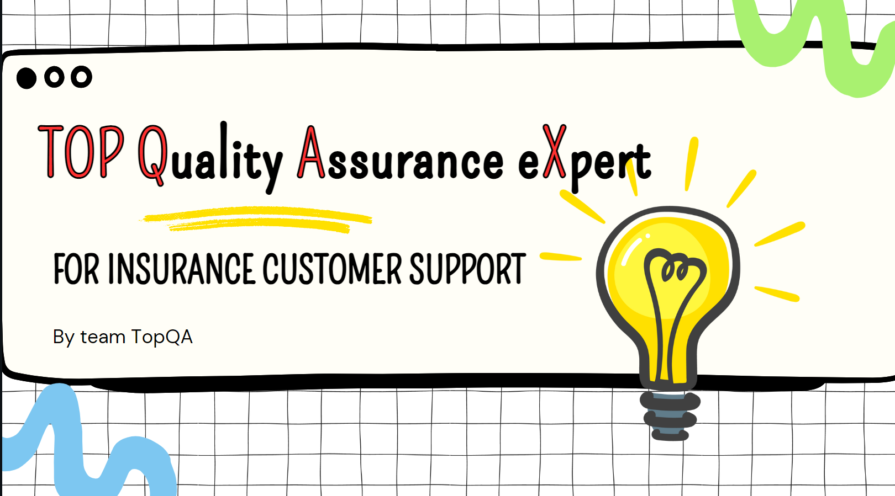
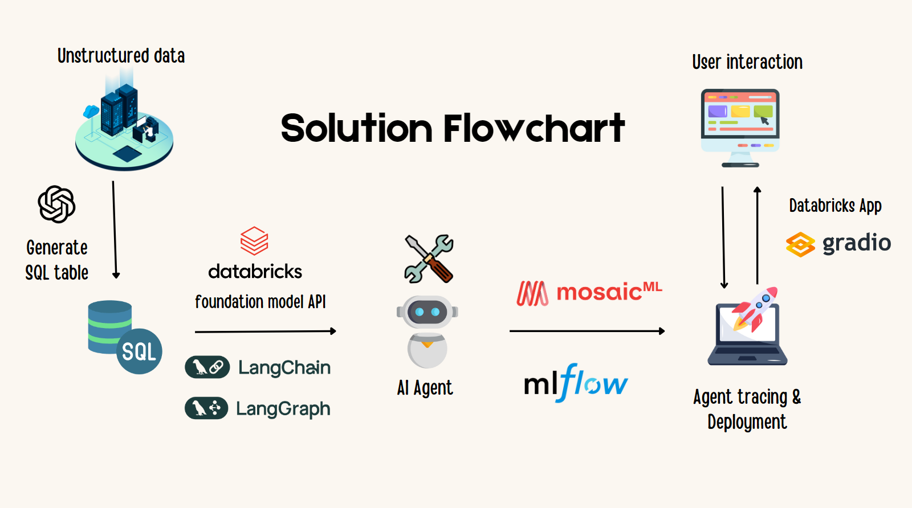
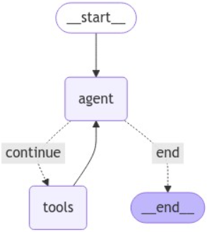
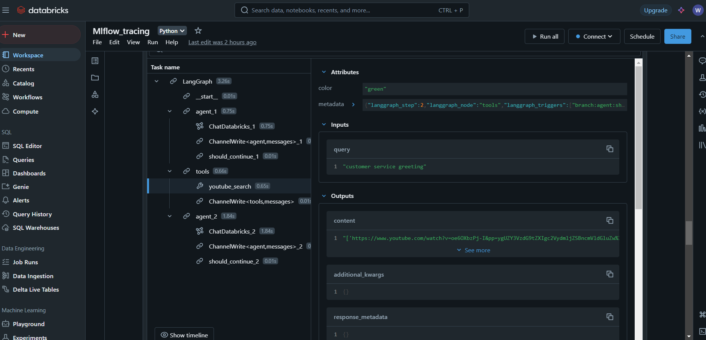
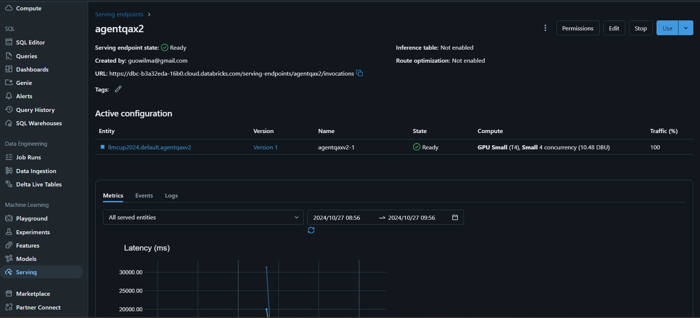
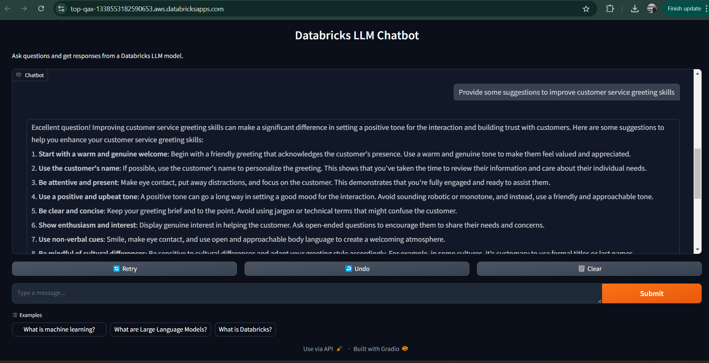

🚀TopQAX documentation for databricks world cup 2024 

# 🏆 **Project TopQAX: Streamlined AI Agent Production with LangChain, LangGraph and Databricks**
<p align = "center" draggable=”false” >
</p>

---

### 🧑‍💻 Overview
This project demostrates an end-to-end solution for deploying a LLM-based AI agent using LangChain and LangGraph on Databricks. Designed specifically to address key challenges faced by customer service managers in the insurance companies, this solution enables seamless interaction and automation, making the AI agent solution production-ready for enterprise environments.

The solution targets the following critical issues:
- Managing over 100,000 chat conversations per month with limited resources
- Overcoming the limitation of manual evaluation on only 1% of conversations, which is susceptible to human error
- Reducing uncertainty around the actual performance of customer support agents, and facilitating the delivery of targeted, actionable feedback to improve agent effectiveness
  
By integrating scalable AI Agent capabilities, this solution empowers customer service managers to monitor and enhance live chat agent performance with accuracy and efficiency.

---

### 🎥 Project Video 

-  You can watch our video at [here](https://www.youtube.com/watch?v=cCT6A6XBoGQ)

---

### 📑 Project Slides 
- You can read our presentation slides at [here](https://www.canva.com/design/DAGLz29gKFI/6y21Q6wdNabQKOZ90h9Kjg/view?utm_content=DAGLz29gKFI&utm_campaign=designshare&utm_medium=link&utm_source=editor)

---

### 📚 Table of Contents
1. [Solution Workflow](#Solution-Workflow)
2. [LangGraph Orchestration](#LangGraph-Orchestration)
3. [Mlflow tracing and Databricks endpoint serving](#Mlflow-tracing-and-Databricks-endpoint-serving)
4. [Gradio UI via Databricks App](#Gradio-UI-via-Databricks-App)
5. [Setup and Installation](#Setup-and-Installation)
6. [Looking Ahead](#Looking-Ahead)
7. [Contributions](#Contributions)


---

### Solution Workflow
Leveraging LangChain, LangGraph and Databricks, this project focuses on bringing AI agent capabilities to production environments. 

 

---

### LangGraph Orchestration
Creates visually structured and interactive workflows.

 

---

### Mlflow tracing and Databricks endpoint serving
Compiled graphs are registered and monitored in the MLflow Model Registry (LangChain Flavor), ensuring seamless versioning and traceability across iterations. 



Databricks Endpoint Serving deploys them as RESTful API endpoints. This enables real-time, scalable access to the AI agent.



---

### Gradio UI via Databricks App
By leveraging Databricks's secure infrastructure, the Gradio UI ensures seamless interaction for enterprise-scale usage, making insights accessible to end-users with minimal setup required.


---

### Setup and Installation
1. **Clone the Repository**:
   ```bash
   git clone https://github.com/wiguo/databricks_llmcup_2024.git

---

### Looking Ahead 
- Fine-Tuned Model:
Develop a fine-tuned model to generate structured data, especially for QA feedback summaries.

- Human-in-the-loop feedback:
Incorporate structured human feedback at the endpoint inference to enable continuous agent refinement and improvement

---


### Contributions 🙏
Contributions, ideas, and feedback are highly encouraged! 🎆

---
